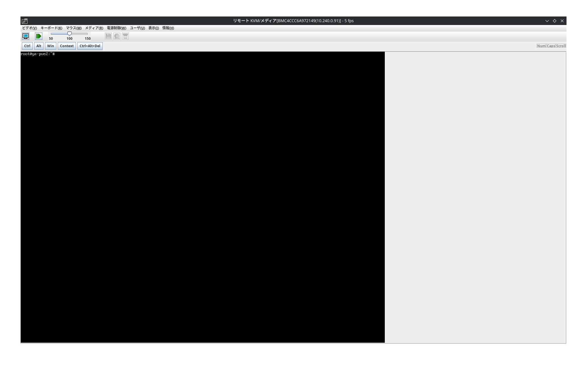

こんにちは、ゃーです。

先日の記事で

> - ラックサーバをしばく
>
>   NEC Express 5800 R120-g を買うだけ買ってしばいてないので。

と書きましたが、放置していたファームウェアアップデートをようやくやったという話です。

# ラックサーバ!

前からしょぼいながらもやっているオンプレサーバですが、デスクトップPCだけでは心もとないですし、ラックサーバがあったほうがおもろいので、ヤフオクで買いました。

と言っても買ってからすでに数カ月経っていて、家の台所の通路に邪魔だな〜と思いながらも、なんだかんだと放置していて今に至ったのでした。

買ったのは NEC Express 5800 R120g-1M で、[間瀬bb](https://x.com/bb_mase)にこのモデルがオススメ!とそそのかれて選びました。

本体価格は2万円+税でした。

中身を見ると、左右で冗長化が図られており、
CPU(ヒートシンクの下に隠れている)も、電源モジュールも2つあり、ファンは8個、画像からは見えづらいですがディスクも8スロット、メモリなんか20スロットくらい(実際には4GB \* 4としょぼいが)、となっているのがわかります。

困ったことにレールがなく、ラックにマウントできないので、ヤフオクなどでレールを探しています。全然ない。
余っているサーバ業者の人がいたらください。

# Proxmoxを入れた

適当にProxmoxを入れました。
上にVMが立ちまくったりすると良さそうなので。

# ファームウェアアップデート

ところで、 NEC Express には _EXPRESSSCOPE 3_ というWebコンソールが用意されており、設定したIPアドレスにアクセスすると見ることができます。

この下にある謎の丸いボタンはリモートKVM死活監視くんらしく、押すと何も起こらなかったり一瞬ウィザードが別ウィンドウで開いたりしますが、
`.jnlp`というファイルがダウンロードされています。

これはJava Web Startアプリケーションのファイルで、これを開けば良いはず
(もちろん適当なJREが必要なだけでなく、Java Web Start(javawsコマンド)が必要です。
筆者の環境はArch Linuxですが、Java8と`icedtea-web`パッケージが必要でした。)

ところが、このjnlpファイルが、マシンのファームウェアのバージョンが古いためフォーマットが壊れており動きません。

そういうわけでファームウェアアップデートが必要なのでした。

## 大いに参考になる先人たち

このファームウェアのアップデート話は、前述の間瀬bbや[whatacotton](whatacotton.com)といった筆者の周りにいる心強い先人たちが残した足跡のおかげでまあなんとかできました。

以下のページが参考になります。

- [WhatACottonの備忘録](https://blog.whatacotton.com/p/welcome-server/)

- [豪族.net]()

  - は落ちているのでフォールバックの[豪族.net的ななにか](powerful.family)

    - もよく落ちるので[powerfulfamily.netのGitHubリポジトリ](https://github.com/masebb/powerfulfamily.net/blob/main/content/posts/NEC-Expressscope3-FW-Update.md)

つまり、
[NECサポートページ ファームウェアダウンロードページ](https://www.support.nec.co.jp/View.aspx?id=9010109882)からファームウェアを落としてきて、zipを展開するとisoが入っているのでそれを焼いたUSBを挿してブートすると勝手にアップデートしてくれるということでした。

ちなみに、R120fの記事ではROM Utilityのアップデートも必要(NECのページにもそう書いてある)とありますが、(少なくとも筆者の)R120gでは必要はないようでした。

また、BIOS LegacyモードではなくUEFIから起動した場合に動きました。

こうして、
(上記記事にもある通りJARのセキュリティレベルを下げる話も必要でした、[ここ](https://techblog.jeppson.org/2018/01/fix-icedtea-cannot-grant-permissions-unsigned-jars-error/)に書いてある)
リモートKVMは動いたのでした。

# 終わり

このサーバは[某トラコインズ](https://ultra.coins.tsukuba.ac.jp/)に置かれる予定です。

次はk8sしばきやね〜。
