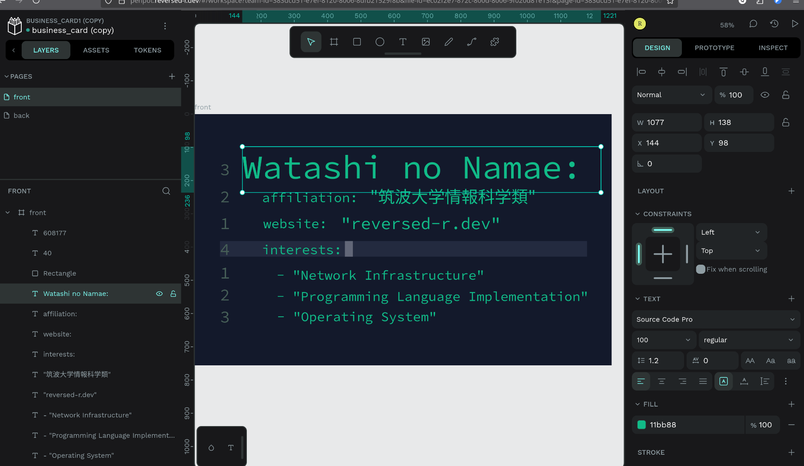
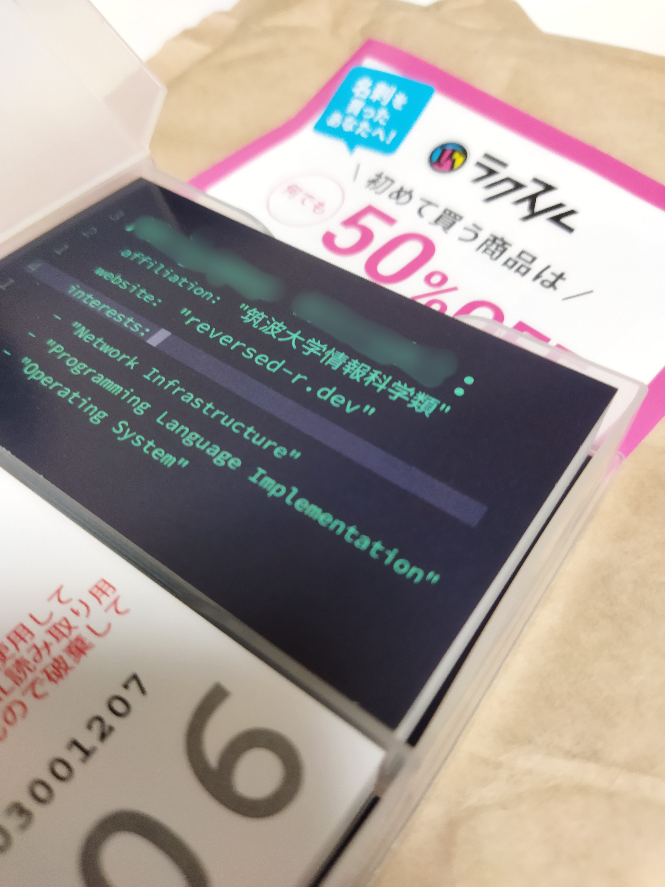

こんにちは、ゃーです。

なんと恐ろしいことに明後日(2025/8/11)からはセキュキャン2025全国大会が始まってしまいます。

セキュキャンでは名刺を配ることが恒例のようで、せっかくの機会なので作ることにしました。

# デザインってやつ、何でしたらいいんだ？

デザインってやつ、何でしたら良いんでしょう。

名刺を印刷してくれるサービスはものによるでしょうが、ラクスルではpdf入稿ができるということで、pdfさえ吐ければ何だって良いということになります。

こういう文字やその他ベクター情報を取り扱うデザインソフトって言われると、

- Adobe Illustrator
- Inkscape
- Canva
- Figma

とかしか思いつきませんが、当然Adobe税なんて払ってられませんし、Linuxで快適に使える必要があります(Inkscapeは実はLinuxのサポートがあるが、OS吹き飛ばすたびに入れ直すのは面倒なのでWebベースだと良い)し...。

あと、CanvaやFigmaなどは使用感が良いという印象はないし、フリープランだと機能制限などがあるとか、あとデータがあっちに持っていかれるのが普通に癪なので(サービス間で互換がないのも困る)ちょっとなあなどと思いました。

せや、**セルフホスタブルなソフトウェアをホスト**しよう!!

ということで、

1. セルフホスタブルCanva/Figmaを探したところ、[Penpot](https://penpot.app/)というのが見つかり、
1. セルフホストしました。

# Penpotセルフホスト時のコンフィグ

前の記事などでも触れていますが、適当なデスクトップPCがサーバ業をやってくれているだけの、
Dockerコンテナ群を管理するためにPortainerなどはいるものの、全く冗長化されていない雑環境のオンプレをしています(早くもっと整備したい)。

ここにもう1個スタックを増やすだけなので簡単ではありました。

`compose.yaml`を錬成してやる必要がありますが、
[PenpotのGitHubリポジトリ](https://github.com/penpot/penpot)の[ここ](https://github.com/penpot/penpot/blob/develop/docker/images/docker-compose.yaml)にあります。概ねこれをパクってくれば良いです。

筆者は次のように書きました([ゃーのPenpotのセルフホスト用コンフィグのGitHubリポジトリ](https://github.com/reversed-R/penpot.reversed-r.dev)にもあります)。
traefikのルーティング用ラベルなどが付いてます。

```yaml
version: "3.8"
services:
  penpot-frontend:
    image: penpotapp/frontend:latest
    depends_on:
      - penpot-backend
      - penpot-exporter
    volumes:
      - penpot_assets:/opt/data
    labels:
      traefik.enable: "true"
      traefik.docker.network: "traefik"
      traefik.http.services.penpot-frontend.loadbalancer.server.scheme: http
      traefik.http.routers.penpot-frontend.rule: Host(`${PENPOT_DOMAIN}`)
      traefik.http.routers.penpot-frontend.entrypoints: websecure,web
      traefik.http.routers.penpot-frontend.tls.certResolver: leresolver
      traefik.http.routers.penpot-frontend.service: penpot-frontend
    networks:
      - default
      - traefik
    restart: always

  penpot-backend:
    image: penpotapp/backend:latest
    depends_on:
      penpot-postgres:
        condition: service_healthy
      penpot-redis:
        condition: service_healthy
    volumes:
      - penpot_assets:/opt/data
    environment:
      - PENPOT_PUBLIC_URI=https://${PENPOT_DOMAIN}
      - PENPOT_SECRET_KEY=${PENPOT_SECRET_KEY}
      - PENPOT_DATABASE_URI=postgresql://penpot-postgres/penpot
      - PENPOT_DATABASE_USERNAME=${POSTGRES_USER}
      - PENPOT_DATABASE_PASSWORD=${POSTGRES_PASSWORD}
      - PENPOT_FLAGS=${PENPOT_FLAGS}
      - PENPOT_REDIS_URI=redis://penpot-redis/0
    networks:
      - default
    restart: always

  penpot-exporter:
    build:
      dockerfile: ./exporter.Dockerfile
    depends_on:
      - penpot-redis
    environment:
      - PENPOT_PUBLIC_URI=http://penpot-frontend:8080
      - PENPOT_REDIS_URI=redis://penpot-redis/0
    networks:
      - default
    restart: always

  penpot-postgres:
    image: postgres:16
    volumes:
      - postgres:/var/lib/postgresql/data
    environment:
      - POSTGRES_DB=${POSTGRES_DB}
      - POSTGRES_USER=${POSTGRES_USER}
      - POSTGRES_PASSWORD=${POSTGRES_PASSWORD}
    healthcheck:
      test: pg_isready -U "${POSTGRES_USER}" || exit 1
      interval: 5s
      timeout: 3s
      retries: 5
    networks:
      - default
    restart: always

  penpot-redis:
    image: redis:7
    healthcheck:
      test: redis-cli PING
      interval: 5s
      timeout: 3s
      retries: 5
    networks:
      - default
    restart: always

volumes:
  postgres:
  penpot_assets:
networks:
  default:
  traefik:
    name: traefik
    external: true
```

フロントとバックとDBのコンテナがいるのはいいんですが、完成したpdfやpngやsvgファイルを吐き出すために*exporter*というのが別のコンテナで分かれているのが特徴的ですね。

あと、DBがPostgresとRedisがいるのは、(挙動的にも)おそらくPostgresがユーザー登録用でRedisがデザインファイル自体の保存用なのでしょう(勝手に推測してるだけなのでわかりませんが)。

なにはともあれこうしてホストできました。[penpot.reversed-r.dev](https://penpot.reversed-r.dev)にて公開されており、別にアカウント登録もできる状態になっていますが、データの永続化や様々について何も保証しないので非推奨です。

# ホストできたのでデザインしまくった



デザインしました。

なんというか、かなりFigmaそのものみたいなUIをしています。

特に使いやすくもなく、かといってめちゃくちゃ使いづらいというわけでもないあたりもFigmaそっくりです。

一応最初のログイン時にAdobe なんちゃらや、CanvaやFigmaだったら何が最も使用経験があるか的な質問がされます。

が、そこで*知らん*みたいな選択をしたはずなのにFigmaそっくりになりましたね。

## PDFがエクスポートできない!!

よ〜し、ある程度デザインはできてきたし、1回エクスポートしてみるか〜となったところ、pdfエクスポート時に固まることが判明しました。
pngやsvgはできるのに。

ログを見てみると、どうやら`pdfunite`コマンドがないのでpdfの結合ができないというのが原因らしい(1ページだけで結合はいらないはずだったが怒られた)。

ので、exporterだけimageではなくbuildにして、`pdfunite`が入っているaptパッケージの`poppler-utils`というやつを入れるようにしてやって完了です。

もとのイメージだとDockerの`USER`が`penpot:penpot`に下げられちゃってるのに注意。

```dockerfile
FROM penpotapp/exporter:latest

USER root

RUN apt-get update && apt-get install -y poppler-utils

USER penpot:penpot

CMD ["node", "app.js"]
```

# 印刷できた名刺が届いた

ラクスルに入稿した名刺が届きました。やった〜。



ラクスルは出荷日が入稿日の1日後、2日後、3日以降後で料金が安くなっていく料金体系を取っており、ペイできないので安い3日コースを選択しました。
注意としてはこの3日後というのは出荷日なので、配送にはもう少し時間がかかります。

もし、来年以降のセキュキャン受講生が名刺作るか〜と思って読んでいたらアドバイスですが、ラクスルなら1週間前には入稿しておいたほうが良いです。
それ以降になってしまったら、店舗があるタイプの印刷所なら数時間とかで受け取れたりするらしいです。

# 終わり

セキュキャン迫ってきており、楽しみです。

名刺も交換しまくれるといいな。

では、また。
