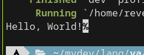
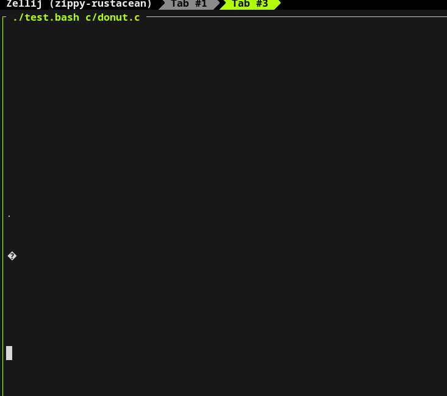
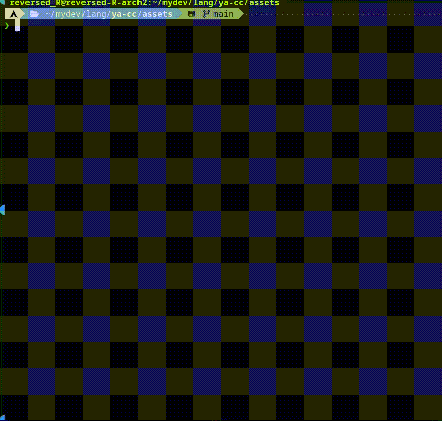
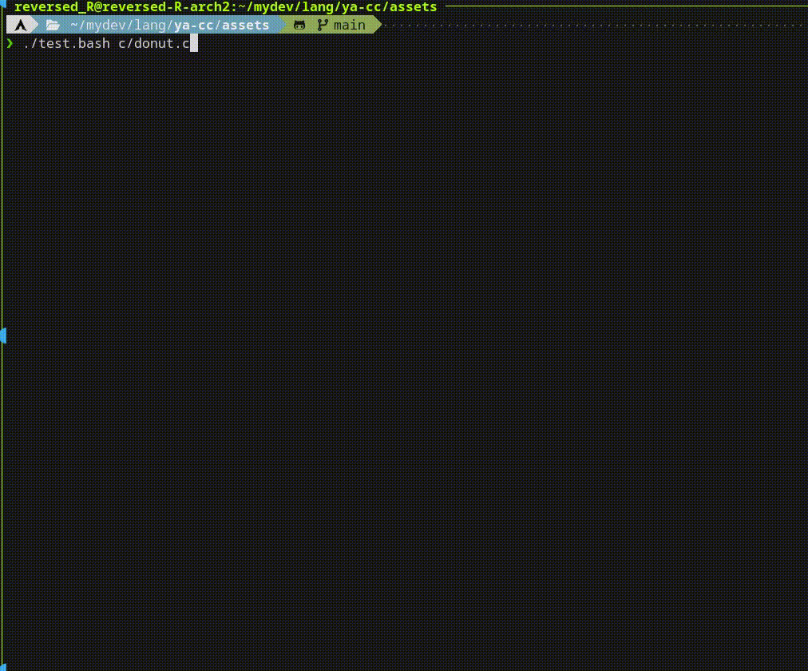
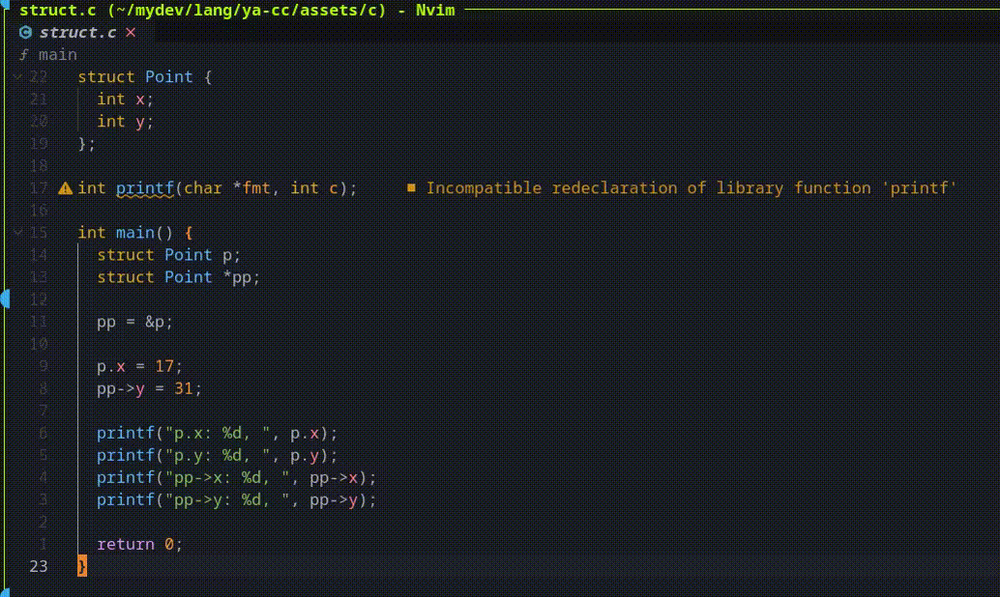

こんにちは、ゃーです。

> なんと恐ろしいことに明後日(2025/8/11)からはセキュキャン2025全国大会が始まってしまいます。

などと書いてから早3週間が経ちました。

セキュキャン行った記事書こう、書こうと思いながらもパソコンが楽しくてなかなか書かないうちにもう9月です。

ようやく書きました。

# セキュキャンとは

[独立行政法人情報処理推進機構であるところの*IPA*](https://www.ipa.go.jp/)が主催していることになっている*セキュリティ*という名義のイベントです。

上のページでは`/jinzai`に含まれていることからも人材育成が目的らしいです。

[セキュリティキャンプ協議会というやつ](https://www.security-camp.or.jp/)もあります。

全国大会2025というやつに参加し、Cコンパイラ自作ゼミを受講してきました。

# 行く前

## 応募する

まず応募せねば始まりません。

セキュキャンはどうやら応募者の熱量を大事にしているらしく、高度パソコン人材とともに軟禁状態でパソコンをしたいという人はぜひ申し込むと良いでしょう。

技術力と熱量に自信を持ってねじ伏せるといいらしいです。

そういえばCDN自作ゼミのほうを第1希望に出していましたが、どちらかといえば応募課題で技術と熱量を見せつけられたのはCコンパイラゼミでした。

ので順当に力を入れたほうが通ったなあという感想です。

後から考えるとCコンパイラゼミのほうも、健闘はしているものの周りのレベル感から考えればギリギリ通って良かったなあと感じました。

[hsjoihs](https://x.com/hsjoihs)、ありがとう〜。

## 通ってからすること

晴れてセキュキャンの合格の通知が来たのが、6月23日とかそこらだったはずで、そこからキャンプまで1ヶ月半くらいあります。

### 事前学習

Cコンパイラゼミは比較的、個人で黙々と実装していく色合いが強く、事前学習期間からゴリゴリと実装を進めていくのが定番らしいです。

[過去ログ](https://sozysozbot.github.io/seccamp-2022-c-compiler-seminar/)なんかも(hsjoihsさんの驚異の手打ち芸によって)インターネットには落ちていますが、やはりそのようです。

私はこのリポジトリ[https://github.com/reversed-R/ya-cc/](https://github.com/reversed-R/ya-cc/)でRustで実装していました。ターゲットはx86_64です。

当初から張り切って、パスを分解することで拡張性を高めたコンパイラを作っちゃうぞ〜などと息巻いて、`lexer`, `parser`, `generator`の3パスに分割されたリポジトリ構成をしていきました。

プログラミング言語の形を取っているものをパースする芸ってなかなか難しく思われるものですが、再帰下降構文解析って思ったよりも簡単なんですね。

各文法要素のノードを再帰的にパースしていくだけです。

我らが教典、[compilerbookこと、低レイヤを知りたい人のためのCコンパイラ作成入門](https://www.sigbus.info/compilerbook)が教えてくれました(こちらはCコンパイラゼミ初代講師のRui Ueyamaさんが2018?年のCコンパイラゼミの後に書いたものらしいです)。

わりとこのパース芸が楽しくてそればっかやってしまいましたが、これは良くなかったです。

コード生成をどうやって行くべきなのかを考えるほうが重要で、(compilerbook内でもよく触れられるし、ゼミでもよく言われるが)*インクリメンタル*な開発というやつが重要でした。

そうして少し遅れを取ってコード生成を始め、スタックの伸び縮みすらまともに操作できず、関数呼び出しをすると二度と帰ってこれないみたいなので苦戦していた記憶があります。

もっと早くコンピュータそのものと向き合うべきだった。

そのうち、基本的な演算や制御構文や関数呼び出しなどがそれなりに動くコンパイラができましたが、型のバリデーションを真面目にやりたいななどと思ってしまい、`parser`と`generator`の間に新たに`validator`なるパスを追加してしまいました。

型に限らずパーサの段階で弾けない構文はあるのでバリデーションをすることには意味があるのですが、この型バリデーションも意味ある〜と言って楽しんでしまい2週間くらい使ってしまったのは、今思うとまずかったかもしれません。

そんなこんなでやっているうちに、筑波大学の気持ち悪い学期制によるテスト期間がセキュキャン直前に訪れ、いよいよキャンプは始まってしまうのでした。

### 名刺を作る

そういえば前回の記事で書きましたが、名刺を作りました。

これはしっかり活用され、交流時間などに配りまくることができました。

来年以降行く人はやはりぜひ作ったほうが良いです。

## 持っていったほうが良いもの

- 服(着ているものを含めて2, 3着)
- **洗濯洗剤**
- 行きの交通費
- 名刺
- **パソコン**

以上です。

以上というのは言い過ぎにしても、軟禁先は思ったよりも何でも揃っていてかなり耐えます。

服は着くなりセキュキャンTシャツとパーカーがもらえるため1日分浮き、洗濯機があるので洗剤さえ持ち込めば、帰宅日含む6日のキャンプは耐えることができます。

また、食事や飲料水は全部出ますし、売店のようなものにはほとんど行くことが許されない(なぜなら軟禁中なので)ので、お金を使う場所がありません。
さらに、どれくらいの遠方から来るかなどに依りますが、事前に計算された行き帰りの交通費を現地で支給してくれるので、会場に到達するためのお金さえ持っていればほぼ真のキャッシュレスを実現できます。

# キャンプ、始まる

リンクフォレスト多摩、やってきました。
昨年まではクロスウェーブ府中というところだったそうですが閉館してしまったらしく、今年はリンクフォレストというKDDIが作った研修施設が会場でした。
全体的にきれいで豪華で広いです。

着いて受付をするな否やオタク箱詰め交流会が始まります(ここで名刺が活きます。あと[間瀬bb](https://x.com/bb_mase)が中国から密輸したアヒルちゃんたちも活躍した)。

あと、大変素晴らしいことに飯がうまいです。

## 開発期間

- 1日目

恒例らしいラジオ体操に参加し(朝6:45に起きられるほど元気だったのはこの日が最後だった)、セキュキャンのメインのところである、講義?ゼミ?開発期間?の時間が始まりました。

同じゼミの人々と(まあ昨日会っているんだが)こんにちは〜などと挨拶し、事前学習のときと変わらず各々実装して詰まったり進んだりしたら報告するというスタイルでいきましょうなどと言われぬるっと始まりました。

ポインタの加減算、`sizeof`、配列、グローバル変数あたりを1日目に実装しました。
思ったよりも進まないなまずいなどと思い始めていました。

- 2日目

`char`型が実装でき、すでに配列もあるので文字列が扱える時代が訪れます。
文字列リテラルを実装し(文字列リテラルはread onlyなセクションに前もって格納されているので、単に`char`と配列があるだけでは駄目)、ついに`Hello, World!`に成功しました。

- 3日目

まずいです。
Rust製Cコンパイラは早々にそれなりのものにして、キャンプ中に爆速でCでセルフホスト達成するぞ〜などと思っていたのは何だったんでしょう。

かなり進まず、キャンプ中にRust製Cコンパイラの方で[2kmcc](https://github.com/sozysozbot/2kmcc)などを疑似セルフホストすることすら怪しいです。

そういえば[donut](https://sozysozbot.github.io/seccamp-2022-c-compiler-seminar/#permalink_586ace5ec659a44830d24d79676ff0fb)というコンパイラ開発のベンチマークとなるよく知られたプログラムがあり、
今年(2025年)のCコンパイラゼミでも1つのチェックポイントとして扱われていました。

が、動かしてみると動かない!

様々なところでセグフォします。
コードが正しいのにセグフォするのをこんなに見たのはこの日が最初で最後でしょう。

ところで、このあたりに来てでかい問題が2つ出てきました。

1. 網羅性のあるテストケースを真面目に通していない
1. 再帰下降の優先順位に基づく階層構造を`parser`から飛び出し、`validator`, `generator`まで引きずっている。

前者はただの怠惰です。
Cコンパイラ作る人のための一覧性のあるテストケースを持ってくるという発想がなかったのもあります。
[hsjoihs/c-compiler](https://github.com/hsjoihs/c-compiler)からテストケースを持ってきて、機能的にまだ通らないものを弾きまくるというのをここに来て行いました。
その結果通るべき`*(式)`の形が上手くコンパイルできていなかったなどと問題がいくつか判明しました。

後者は明確な設計ミスです。
Rustの型定義の強力さを使いたくなってしまったというのもあります。
しかしよくよく考えると式というのは`expr`のような1つの型で十分なんですよね(Rust的には構造体のあるときは使わないフィールドのようなものは許さないので、実際には式を表す(Rustのリッチな)`enum`で単項、二項、原子的式(*primary*などと呼んでいる、定数とか変数とか)に分けることにはなりますが)。

これに気づいたのがたいへん遅くもはや開発期間も終わる頃でした。結局時間が来てもドーナツは回らず、大変悔しい思いでした。

## セキュキャンの講義以外の部分

セキュキャンは別に講義でパソコンをしているだけではないのでそのへんも書いておきます。

なんか毎晩、LT大会とか*BOF*?(類は友を呼ぶ)会とかがあります。

前述の通り朝にはラジオ体操があります。

みなさんが*7500*円をIPAに振り込んでくれるために(?)、ご飯も美味しいです。
朝は大体いつも同じメニュー群からバイキングしていく形式、昼は3種類から選べるご飯、夜は決まったいい感じのディナーです。
昼夜は食券を忘れると絶滅してしまいますので、朝講義の部屋に行くときに忘れないようにしたほうが良いです。

開発期間が終わった次の日は、様々なゼミの最終発表をざっとやり、午後は協賛企業様方の元に連行されてお話を聞いたりしまくります。
どうでも良いが特務機関NERF防災のGEHIRN株式会社からノベルティでもらった生姜焼き缶が良かった。

期間を通していろいろなパソコンオタクと交流するきっかけがあります。

## 開発は終わらない

企業交流&&懇親会が終了した後、どうしても期間中にドーナツくらいは動かしたい私は、命を削って前述の設計ミスをリファクタリングすることにしました。
うちに帰るまでがセキュキャンなので、帰宅日の前夜などは当然セキュキャン内だからです。

このリファクタリングを自分の宿泊部屋で途中気絶しながらやり、帰宅日であるところの翌午前6時についに、なんか微妙に壊れているドーナツを動かすことに成功しました。

これで安心して寝られる...と思い気絶し、強制退去の30分前の8時に起きてのそのそと帰宅をしましたが、最終日の朝も朝食はあったらしいですね!!食べ損ねて悔しいです。

つくばんちゅたちと帰宅途中、*ハードウェア魔改造ゼミ*の人々と秋葉原に寄ったりしていると、他にもセキュキャン帰り勢がぞろぞろいるなどしました、よく聞く話ですが真実なんだなあ。

そんなこんなでセキュキャンは一瞬にして終了してしまいました。
楽しかった。短かった。大したことができず悔しい。

セキュキャンは目標ではなく通過地点だなどいうツイートを見かけたりしますがあれはその通りで、やり残したこと、これからやりたいこと、知りたいことはいっぱいあります。
もっとコンピュータを分かりたいと思えるキャンプでした。

帰ってからというものの、Cコンパイラの拡充をやっていました。
エラーメッセージを改良したり、`char`型のバグを修正したところドーナツがきれいに動くようになったり、構造体を実装したり。

構造体ができたのでセルフホストも近いかと思われたあたりで今は止まっており、LLVMバックエンドの自作言語を爆速で作ったろうと思い今やっています。
基本的な演算や制御構文や関数、シンプルな型システムやモジュール解決を実装しましたが、今度は設計上構造体を実装するためにはGCを実装しなければならないのでそこが問題です。
近いうちに記事にすると思います。

# 終わりに

セキュキャン、楽しすぎました。

前よりももっとパソコン、もっと分かりたいという気持ちでいっぱいです。

まだ参加してない興味ある人はぜひ申し込むだけでもすると良いと思います、応援。

では、また。
