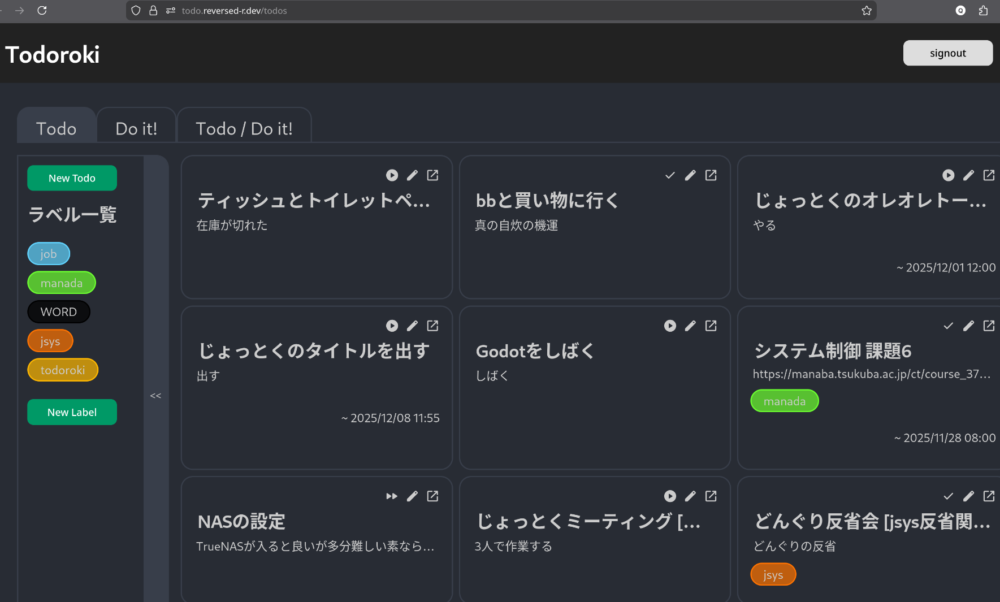

(この記事は[jsys25アドベントカレンダー](https://adventar.org/calendars/11933)2日目の記事です。)


こんにちは、ゃーです。

[2025年も終わり](https://2025年も.owari.shop/)ですね。

昨日トライアルに行ったら2026年始まるよ~とばかりに正月飾りが売っており、俺の2025年はまだ終わってないんですが?という気持ちになりました。

2025年は私としては激動の年であったなあと思っているところで、

- [1月に大学の宿舎から現在のアパートに引っ越し](https://www.word-ac.net/post/2025/0228-hikkoshi2025/)、
  だいぶ生活スタイルが変わりました。
  食事なども大きく変わって、もはや飲食店もないので気合で買い物&&自炊をしていた一の矢の頃に比べて、
  どのスーパーも近くはないくせに飲食店だけある今の地区では、
  外食をしまくり、そうでないときは蕎麦屋がくれたふりかけをご飯にかけて食べる形に安定してしまいました。
  [今の私の体は外食6割、ふりかけご飯2割、その他2割ぐらいで構成されていると思います](https://arata-nvm.hatenablog.com/entry/2024/12/02/053201#%E3%83%91%E3%83%83%E3%82%AF%E3%81%94%E9%A3%AF)。

- jsysでは今年度のネットワーク部門長の役を拝命し
  (今でこそなんとかやれているものの当時は技術も本当に何もわからなかったもんで、去年終わりから今年初頭は必死こいて技術を手につけるようにしていたなあと思います)、

- [夏にはセキュリティキャンプに行き](/articles/2025-09-02-seccamp2025-ccompiler/)、

- 秋が来たかと思うと[雙峰祭](https://sohosai.com/)でjsysは佳境に...。

# jsysとは

一応これは私の個人ブログなのでjsysでないところからも見に来る人がいると思います(そう信じています)ので、jsysとはという説明をしておきましょう。

筑波大学学園祭(_雙峰祭_)実行委員会 情報メディアシステム局 という組織で、
情報システムやメディアで学園祭を支えよう、面白くしよう、という実行委員会の中でも比較的風変わりな部隊になります(そしてその略称が*jsys*です)。

やっていることとしては、[公式ホームページ sohosai.com](https://sohosai.com/)の開発/運用や、
当日の生配信の映像撮影から現場に敷設したインフラを経由して[自前の配信サイト](https://live.sohosai.com/)で配信するところまでや、
[企画検索システム](https://search.sohosai.com/)、[委員会と企画出店者とのインタフェースとなるアプリケーション](https://sos25.sohosai.com/)、内省ツールなどなど多岐にわたります。

システムの部分とメディアの部分があり、それぞれネットワーク部門(<- なんだその不正確な名前は)と映像部門(<- わかりやすくて良いね)です。

私は前述の通りこのネットワーク部門の長を拝命してしまったのでした。

# jsys25できなかったこと個人的1選: タスク管理

jsysのみんなのおかげで[jsysやったこと100選](https://zenn.dev/sohosai/articles/fab04eefa12115)があれば、jsysできなかったことn選もそれぞれの胸のうちにあることでしょう。

さて、私のjsys25できなかったこと個人的1選は、タスク管理です。

私はかねてよりタスク管理が苦手で、タスクやスケジュールを文字に起こさずオンメモリに載せたままにしてしまうというのがありました(記憶力はまあまあ良いとは思いますが、記憶って緩やかに揮発するので...)。

jsysのような複数人でものを作りタスクやスケジュールの管理が必要な(しかもマネジメントもする側での)活動とは絶妙に相性が悪く、
もっと真面目に(システマティカルに)タスク/スケジュール管理しておくべきだったなと思う頃にはもうjsysは佳境で、
あっという間に終わってしまってからもっと上手くやれただろうなどと思うのでした。

私のタスク管理の下手さはjsysではきっとそれなりに迷惑をかけたことでしょうし、今後もこのままでは困ります。
どうにかしなければならない...。

# そういうわけで、ソフトウェアを作りました

はい、そういうわけで、ソフトウェアを作りました。



[ここ](https://todo.reversed-r.dev/todos)でホストされています。

ソースコードは[これ](https://github.com/reversed-R/todoroki-server)と[これ](https://github.com/reversed-R/todoroki-client/)です。

**_Todoroki_**という名を与えられたこのアプリケーションは、

- 私のすべてのタスク(_Todo_)が載るようにし、もはやこれを見ればすべて分かるようにする
- 可能な限りタスクを公開し、認識の齟齬が発生しないようにする
  - その際、タスク名と詳細を任意で伏せられ、公開する代替の名前をつけられる
- 他人からのタスク追加などの指摘(**_Do it!_**)を可能にする

ことを目的に、
_私の**Todo**をインターネットに轟かして管理する_、
をコンセプトとしています。

要は、おらのタスクもスケジュールもパブリックインターネットに公開するから代わりに不足があれば指摘してねということです(なんと他人任せな!!)。

jsysが終わる頃から構想はあったものの実質的に書いたのはjsysが終わってちょっと暇になってから2週間程度暇を見つつだったので、
特にフロントなんかはだいぶ作りが適当だったりします。

大体次の機能を搭載するつもりだったのですが、

- スケジュールも管理したいのにカレンダービューがないのは困る(せっかくtodoのスケジュールに毎週繰り返しなどを作ったのに) (フロント)
- フロントもバックもクエリが雑すぎて、すべてのtodoが並んでしまう
  - 完了済みのtodoなんてそもそもDBから取ってくる必要がない(バック)
  - フィルタリング、ソートしたい(フロント)
- _Do it!_ はtodoの提案なので _Do it!_ からtodoを作るが出来るべきだがまだやってない(フロント)
- [架空のTsukuda大学で使われているmanadaから課題を取得して](https://github.com/rqdaA/mana-kadai)表示する(`feature="manada"`)予定だったがまだやっていない(バック)
- 授業もインポートしたい(フロント)

普通にやることが多く、先延ばしにしています。

_(オープンソースでセルフホスタブルなので誰かコントリビュートしてくれても良いんですよ?)_

# 技術的な話とか

## バック

jsys的にはよく知られたよくできているバックエンドとして[sos](https://github.com/sohosai/sos24-server/)(上述の企画者と委員会のインタフェースのアプリケーション)があり、
基本的な構成は技術スタックからリポジトリの構造までほとんど同じです(jsysで今年最初にやったのがこれであったが、これ以上によく考えられて作られているバックエンドはなかなかなさそうなので)。

- Rust
  - [axum](https://crates.io/crates/axum) (WebAPI用crate。非同期ランタイム[tokio](https://crates.io/crates/tokio/)が提供している)
  - [sqlx](https://crates.io/crates/sqlx) (ORM(もどき)。DBスキーマからコンパイル時にクエリの正しさを検証すること、ほぼ素のSQLを書くことなどが特徴だろうか。SQL書けばわざわざORM独自のAPIを調べなくてもクエリできるという点で私は好きです)
- PostgreSQL
- DDD(レイヤードアーキテクチャ)
- Firebase Authentication

などなど

sosと比較してだいたい同じなので本家を見れば分かることは特に書くほどでもないかなと思いますが、
sosとは違う(敢えて変えてみた)部分を触れようかと思います。

- 厚く保証をするdomainと薄いusecase

  - presentation層が直接domainに依存することを許す
    DDD(レイヤードアーキテクチャ)というものは、

    ```
    infrastructure -> domain <- usecase <- presentation
    ```

    というレイヤーの依存構造を取り、基本的には接しているレイヤ間での直接依存しか許しません。

    が、[sosのエラーハンドリングで各usecaseに分配された(invalid datetime formatとかpermission deniedみたいな元々1つだったものまで各usecaseに分割されてしまった)エラーをpresentationですべてエラーレスポンスにマッピングしており](https://github.com/sohosai/sos24-server/blob/main/crates/sos24-presentation/src/error/convert_error.rs)これって本当?となったり、
    ほとんど構造的に変わらないusecase <-> presentation間の構造体の変換も手間に対してメリットが大きくないと考えるなどし、

    エラーはdomainが提供するすべてがマップされた(それでもめちゃくちゃ大きいわけではない)エラーenumを一貫して使い、
    usecaseが取る型も構造が多少異なりDTOが必要である場合を除きdomainの型を使うようにしました。

    これはDDD的に正しいのかという賛否両論あるところだとは思われますが、DDDの制約のせいで実装コストが無駄に増大することはなく保守性を下げないラインを狙ったつもりです。

  - permissionチェック

    sosにおいて権限管理は[ユーザのロールに各ビットに権限が対応したビットフラグが立っているかを内部的には使っています(別にdomainからそれが漏れ出るわけではないのでusecaseの実装をする際にそれを意識する必要はない)](https://github.com/sohosai/sos24-server/blob/main/crates/sos24-domain/src/entity/permission.rs)。

    これはわりとよく使われる手法ではあるらしくよくできているとは思います(今年は権限の種類が足りなくなり`u32`から`u64`に伸ばしたというのはまた別の話...)が、
    特定のエンティティに対して権限があるか(例えば、同じロールのユーザでもエンティティの作成者自身は更新できるがそれ以外はできない、というような)場合に対応できる柔軟性がありません。

    そこでtodorokiではPermissionはenumで定義してしまい、Rustのリッチなenum(代数的データ型の直和型)は値を持つことが出来るのでそこに対象のエンティティをもたせることで詳細な権限チェックを可能にしました。

    メリットとしてはdomainが複雑な権限チェックまで保証できること、デメリットはdomainの権限チェックをしている部分がちょっとグロくなることでしょうか。

    [↓ `matches!()`や分岐を多用している部分](https://github.com/reversed-R/todoroki-server/blob/main/crates/todoroki-domain/src/value_objects/permission.rs)がややグロい(煩雑)。未認証のクライアントも閲覧系の権限はあるという仕様も複雑化の要因かもしれない。

    ```rs
    #[derive(Debug, Clone)]
    pub enum Permission {
        CreateUser(User),
        ReadUser,
        // UpdateUser(User),
        // DeleteUser(User),
        CreateTodo,
        ReadTodo,
        ReadPrivateTodo, // name や description に private ガードがかけられているものを読めるか
        UpdateTodo,
        DeleteTodo,
        CreateDoit,
        ReadDoit,
        ReadPrivateDoit(Doit), // name や description に private ガードがかけられているものを読めるか。 Doit の作成者自身である場合はContributorも読める
        UpdateDoit(Doit),      //  Doit の作成者自身である場合はContributorも更新できる
        DeleteDoit,
        CreateLabel,
        ReadLabel,
        UpdateLabel,
        DeleteLabel,
    }

    impl<'a> ContextedClient<'a> {
        pub fn has_permission(&self, permission: Permission) -> Result<(), ErrorCode> {
            let has = match self.client() {
                Client::User(u) => match u.role() {
                    UserRole::Owner => true,
                    UserRole::Contributor => matches!(
                        permission,
                        Permission::ReadTodo
                            | Permission::CreateDoit
                            | Permission::ReadDoit
                            | Permission::ReadLabel
                    ),
                },
                Client::Unregistered(email) => {
                    matches!(
                        permission,
                        Permission::ReadTodo | Permission::ReadDoit | Permission::ReadLabel
                    ) || if let Permission::CreateUser(u) = permission.clone() {
                        (u.role() == &UserRole::Contributor
                            || (u.email().clone().value()
                                == self.default_owner_email().to_owned().to_owned().value())
                                && u.role() == &UserRole::Owner)
                            && u.email().clone().value() == email.clone().value()
                    } else {
                        false
                    }
                }
                Client::Unverified => matches!(
                    permission,
                    Permission::ReadTodo | Permission::ReadDoit | Permission::ReadLabel
                ),
            };

            if has {
                Ok(())
            } else {
                Err(ErrorCode::PermissionDenied(Box::new(permission)))
            }
        }
    }
    ```

- Firebase Authによる認証とユーザ作成(DBへのレコード追加)の順番

  sosは筑波大学の学生であることを検証する都合上`@*.tsukuba.ac.jp`のメールアドレス(多くはoutlook)を認証に使っています。

  サインアップすると、(ユーザのレコードがDBに追加された後)Firebaseの認証リンクが含まれたメールが届き、それを踏むことでemail verifyが完了するという仕組みです。

  問題点としてはユーザレコードを見ただけではemail verifyが完了していないことがわからない点で(ユーザがリクエストするときはJWTを検証できるので通常は問題ない)、
  ユーザ一覧に未認証のユーザも表示されるなどがありました。

  todorokiではGoogleアカウントを使っており、ユーザを作成するときもJWTを要求するようにし(つまり認証済みであるようにし)、その順で操作するフロントを設けました。

  この方式にするとバックでJWTは付いているがユーザが作成されていないクライアントを考える必要が出てきたりして面倒ではあるものの、
  ユーザレコードにあるが認証が済んでいないというよくわからないユーザが発生することは防げます。

  その他の方法としては、`users`テーブルに`email_verified BOOLEAN`カラムを作り、認証済み初回リクエスト時に`TRUE`にする、という方法も考えられます。

  私が取った方法をsosで採用するとユーザ情報を打ち込む前にメールボックスを開くことになり、よくわからなくなるし、こっちのほうがいいかもしれません。

  とにかくsosの認証周りは改善の余地があるかと思われるので、来年に期待です。

## フロント

[企画検索システム](https://search.sohosai.com)でも採用されていたTanstack Router, Queryを使いました。

ファイルベースルーティングや型安全で非同期性の高いクエリは快適だなあ~という感じです。

見た目は正直それなりならなんでもよく、使えればいいので[MUI](https://mui.com/)などを使いました。

わりとsosとかはそういう思想でよいのではと思ったりもします。

あとは、コンポーネントの細かい挙動やスタイルなどは、全体の構成を確定させた後、震えながら雰囲気コーディングもしつつ作りました。

## デプロイなど

前の記事などでも書いていますが、Portainerで適当に管理されたオンプレの適当なコンテナ畑で動かしています。

# 終わりに

そんなこんなでjsys25はなんとか走り抜け、私は今こんな感じで暮らしています。

jsys26に期待しております。

もし困ることがあったならば、*Todoroki*に**_Do it!_**を書き込むなどしていつでも私を呼んでください。

では、また。
