(この記事は[coinsアドベントカレンダー2025](https://adventar.org/calendars/11747)12日目の記事です。)

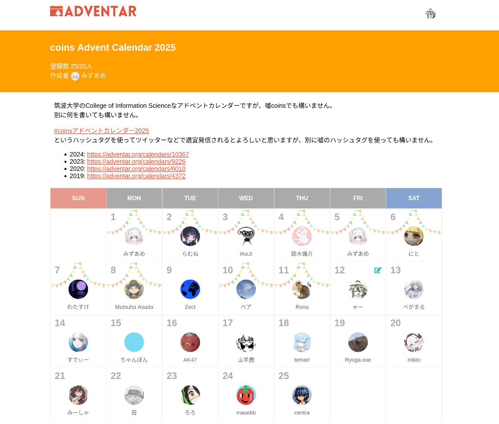

---

こんにちは、ゃーです。

[去年アドベントカレンダーでこのブログのおおもとを作ってから](/articles/2024-12-02-website-hosted-with-nextjs/)、早1年が経ってしまったということです。早いものですね。

さて、冬はインフラの季節という説があり[^what-is-winter-season-of]、NASを自宅でホストして私や家族の画像などのバックアップストレージとして活用したくなりました。

例のごとくヤフオクに行き、安いNASを探していたところ、 _牛さんの「繋がる駅」(Buffalo LinkStation LS220D)_ が売っていたので、
そんなに高くないし、下調べをした感じではDebianを入れられ _開かれたメディアの金庫室([OpenMediaVault](https://www.openmediavault.org/))_ を入れることが可能でギリ使えそうなので、初発の入札をしたところ誰も応戦してこないので購入することになってしまいました。

[^what-is-winter-season-of]: 正規表現エンジンの季節という仮説もあり、こちらの実践については https://word-ac.net にいずれ公開されることと思います。

# とりあえず素の状態で起動

届いたLinkStationがこちらです。

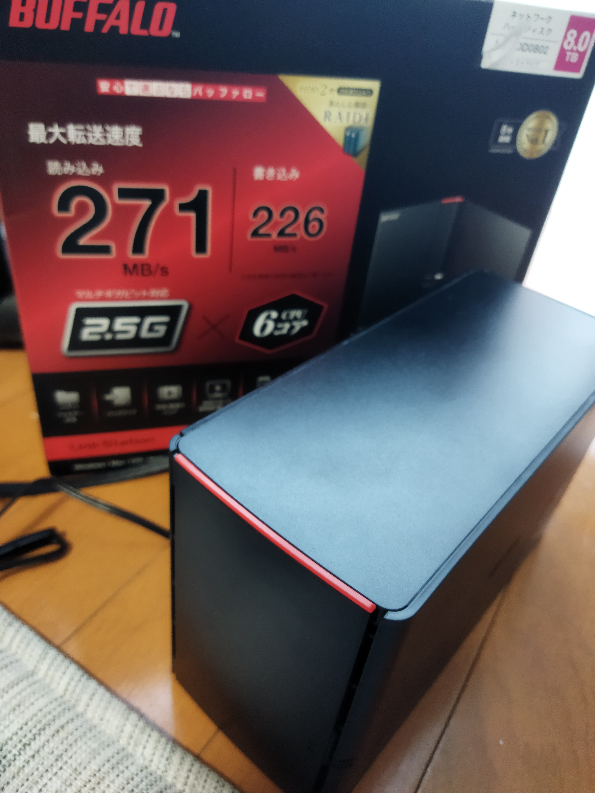

見た目はそれなりにきれいで、包装もBuffaloの販売時のものがほぼそのままで、比較的状態がよいと言えそうです。

とりあえず素のLinkStationのまま起動確認をし、UIを見に行きましょう。

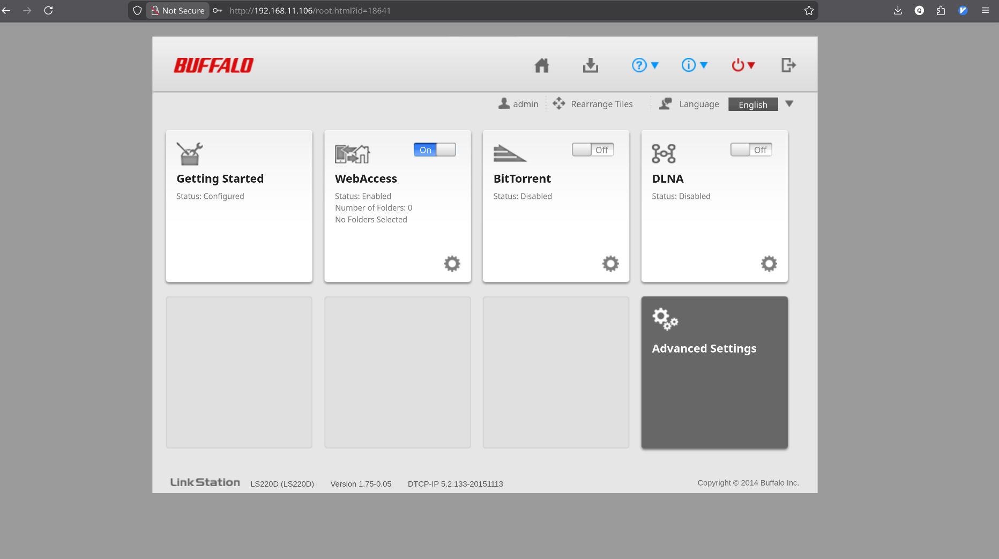


(HDDの刺さりが甘かったのか当初ディスクを認識せずに焦りましたが)無事立ち上がり、このようなUIが見られました。

`全社員共通`という前の利用者さんのユーザーグループが残っていること以外はちゃんとリセットされていました。

予想通り使いづらそうなUIではあります。

あと、この時点で私のラップトップからsmbで画像を保存できることは確認できました。

# NASのOSを取っ替えよう

まあそのまま使うには微妙なUIが予想通り出てきたことですし、適当なNAS用OSの類をインストールしようということになりました。

smb開通しているし意味ないのではという主張ももちろんありますが、おもしろいのでやります。
あと、今のところどちらかといえばソフトウェア屋さん的活動をしていますが、将来LLMのせいで失職してガジェット屋さんに転職する可能性もあるかもしれません。LLMはシェルは握れても物理のディスクは握れないので。

フリーでよく使われるNASには

- [TrueNAS](https://www.truenas.com/)
- [XigmaNAS](https://xigmanas.com/xnaswp/)
- [OpenMediaVault](https://www.openmediavault.org/)
- [Rockstor](https://rockstor.com/)

などがあるようですが、
LinkStationはBuffaloの元のOSがLinuxベースらしく[^buffalo-embeded-os]、Debianを入れる方法はwell knownなようなのでDebianベースのOpenMediaVaultを入れることにしました[^base-os-of-nas]。

[^buffalo-embeded-os]: https://www.buffalo.jp/support/faq/detail/6150.html

[^base-os-of-nas]: XigmaNAS含むTrueNAS(旧FreeNAS)系はFreeBSDベースらしい。RockstorはCentベースが途中からOpenSUSEベースになったっぽい?

# Debianを入れる

[Debian on Buffalo](https://github.com/1000001101000/Debian_on_Buffalo)というBuffaloでどうしてもDebianを動かしたすぎる名前がビット列の先人が作ってくれたインストールツール群のリポジトリがあります。
最終更新が`2 weeks ago`となっているなどメンテされており、気持ちがありすぎます。

LinkStationにDebianやOpenMediaVaultを入れたい人の記事はインターネット上に多少あり、

- [Linkstationにopenmediavaultをインストールする](https://bluetone2016.hatenablog.com/entry/20220101/1641034481)
- [LinkStation LS220D に Debian をインストールする](https://note.com/tmi/n/ncfe6209f4676)

などです。2つめについては2025年9月と情報が新しく同じLS220Dであることから、もはやこれのこすり直しをすれば完成です。

関連する話としては、どうやらLinkStationは設計が終わっており[^buffalo-dameruko-bakkyalo]ディスクの中に起動OS自体もインストールする設計なので、
1ディスクが死んだりディスクを取り替えようとしたりしてBuffaloのOSを入れている記事もいくつかあります。

[^buffalo-dameruko-bakkyalo]: Buffaloは数々の微妙な設計の機器を販売してきたために、旧社名メルコ時代は「ダメルコ」、現在は「バッキャロー」という呼称もあるとか。かわいそう。でもNASの同じディスクにOSも入っているのはやめてほしかった。

- [BUFFALO Linkstation LS220Dの抜け殻なんて拾うんじゃなかった](https://qiita.com/Keiyaku_Shine/items/333912defbf92f2e52ec)
- [LinkStationのハードディスクを交換する](https://kanalabo.net/repair/linkstation_hdd_change/)

タイトルからして不穏なものもありますが、まあ...。

さて、Debianを入れていこうと思いますが、[Debian on Buffalo の wiki](https://github.com/1000001101000/Debian_on_Buffalo/wiki)や、[そこでも紹介されている謎の外国人の動画](https://www.youtube.com/watch?v=dfMHlLmsSF8)、先述の2つめの記事を参考にすれば普通に入ります。

手順としては以下のとおりで、

1. [acp-commander](https://github.com/1000001101000/acp-commander)というDebian on Buffaloの作者が別リポで作っているツールをダウンロードしてきてjavaで実行。

```bash
java -jar acp_commander -t <NAS-IP-address> -pw password -o
```

すると、どういう仕組みなのかわからないがtelnetのrootパスワードがリセットされます。

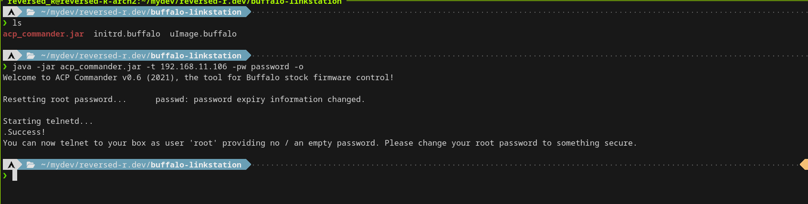

2. telnetで中に入り、`/boot`を覗くと`initrd.buffalo`と`uImage.buffalo`というファイルがあるのが確認できます。

どういう方法でもいいですが、この2ファイルをDebian on BuffaloのリポジトリにあるLS220D用のファイルで置換すればDebianのインストーラが立つようです。

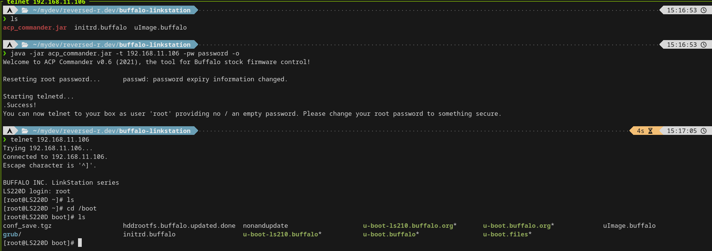

今回は、動画や2つめの記事が採用していた、作業をしているマシンで一時的にHTTPサーバを立てて2つのファイルをサーブし、NAS側からwgetで取りに行く作戦を取りました。

2ファイルがあるディレクトリで

```bash
python -m http.server
```

をし、
NAS側で

```bash
wget http://<Laptop-IP-address>:8000/initrd.buffalo
wget http://<Laptop-IP-address>:8000/uImage.buffalo
```

します。

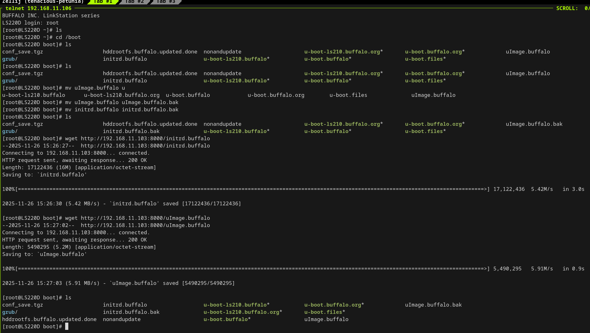

3. Debianインストーラを起動

再びacp-commanderで

```bash
java -jar acp_commander -t <NAS-IP-address> -pw password -c "reboot"
```

としてrebootをかけ(今考えるとtelnetでもできるのではという気もする)、

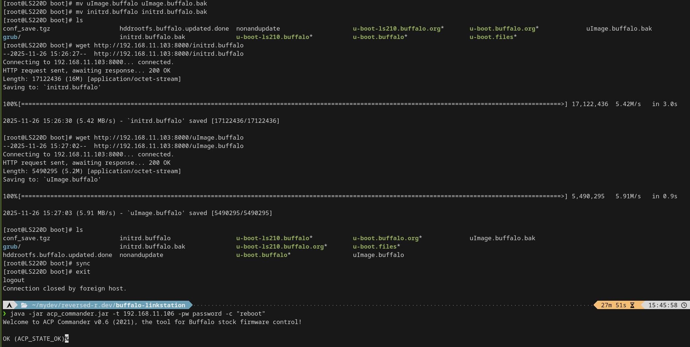

そうすると、

```bash
ssh installer@<NAS-IP-address>
```

でよく知られたDebianのインストーラが起動します(私は素のDebianを使ったことがないのであんまり知らないのですがこんなに水色かったっけ、もっと青かったような気が。環境依存なのかな)。

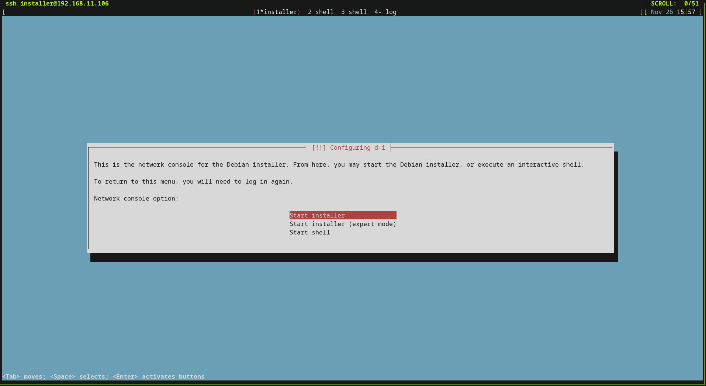

重要なのはどうパーティションを設定するかで、インストーラくんは賢いらしく元のパーティションの切れ方を認識しておりそのまま使えます。

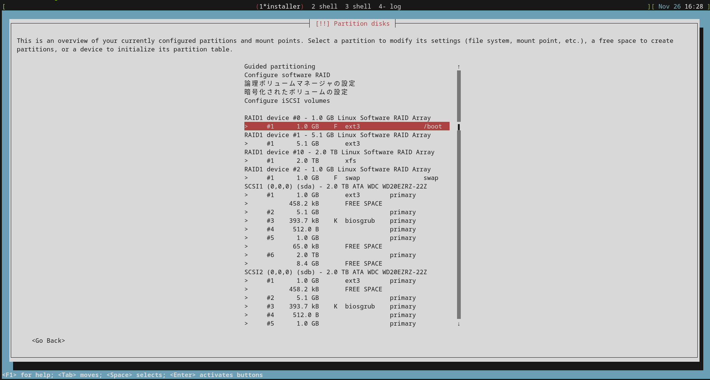

どのパーティションをどうフォーマットし何に使うかは正しくやる必要があり、

- `/boot`はLinkStationのファームウェア?の仕様上ext3フォーマットでなければならないらしい。`/boot`として1.0GBに切れている部分を使う。
- `/`はDebianが読みに行くのでフォーマットは何でも良いと思われるが、5.1GBに切れている部分を使う。
- `/swap`はそのままでよい。
- その他のディスク領域は、何でもよい。今回は2.0TBずつのRAID1が認識されており、RAID1にするつもりだったので`RAID1 device`をext4フォーマットで`/mnt/array`にマウントした。

とやりました。

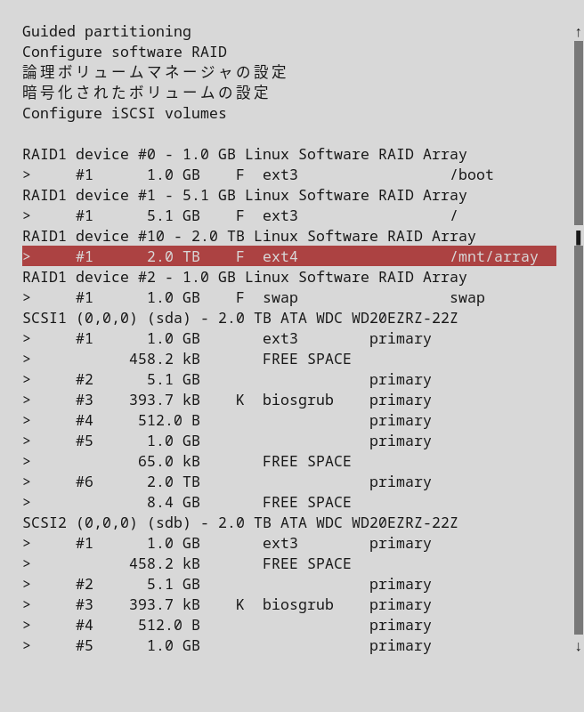

`/boot`をフォーマットしてしまうのは怖いですがこういうもんらしいです。
そういえば、`.bak`としてバックアップしておいた元の起動ファイル群はこの時点で消えていることになりますね...。

こうして設定は完了したのでインストールを開始ししばらく待つと...

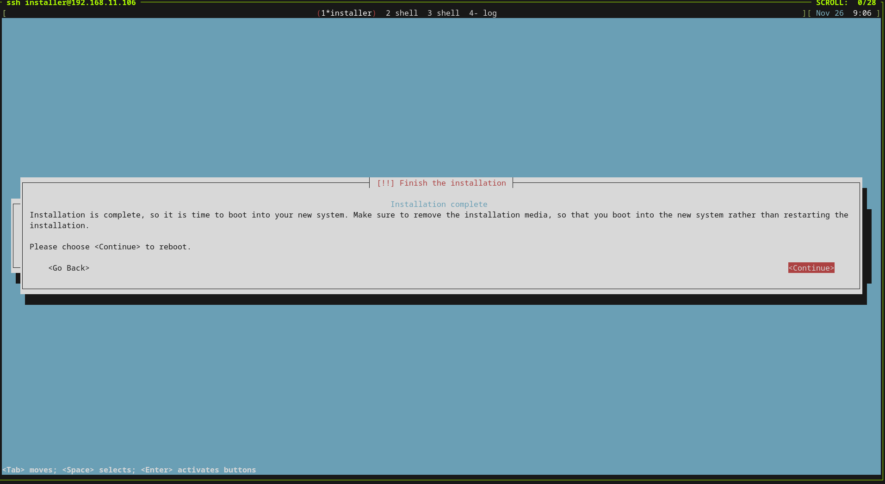

インストールが完了しました。

sshで接続すると

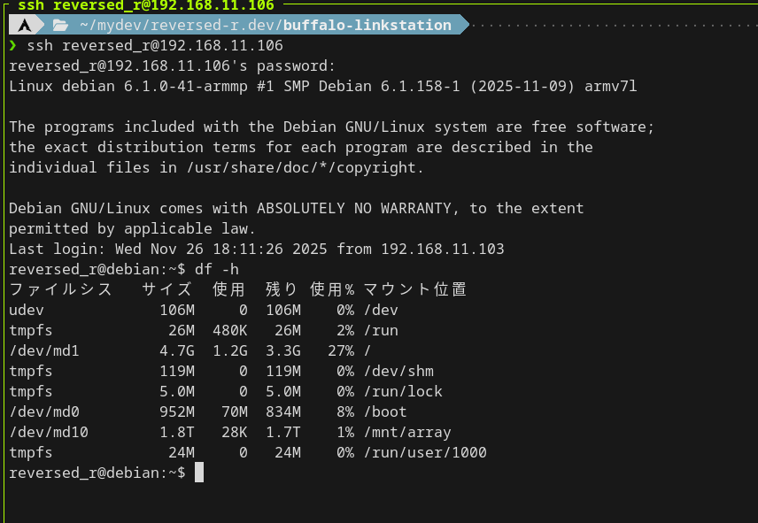

正しくパーティションがマウントされているのがわかります。やったー、成功です!

# OpenMediaVaultを入れる

Debianが入ったので山場は超えたといってもいいんではないでしょうか。

あとはこの上にOpenMediaVaultを後入れしてNASとして使えるようにするだけです。

[OpenMediaVaultの公式が出しているDebian上にインストールする場合の説明](https://docs.openmediavault.org/en/latest/installation/on_debian.html)では、最終的に

```bash
apt-get --yes --auto-remove --show-upgraded \
    --allow-downgrades --allow-change-held-packages \
    --no-install-recommends \
    --option DPkg::Options::="--force-confdef" \
    --option DPkg::Options::="--force-confold" \
    install openmediavault
```

こんな感じでaptで入れれば良いんだとありますが、
LS220Dはarmhfをアーキに採用しており

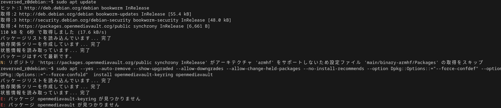

こんな感じでデフォルトではパッケージリポジトリにありません。

適切なリポを追加すれば良いはずですがめんどいので、[OpenMediaVault-Plugin-Developers/installScript](https://github.com/OpenMediaVault-Plugin-Developers/installScript)というこれまたあやしいスクリプトを回します。

```bash
time wget -O - https://github.com/OpenMediaVault-Plugin-Developers/installScript/raw/master/install | sudo bash
```

1つめの記事に書いてあったのでそのまま実行しました。大いなる責任、伴いまくり。

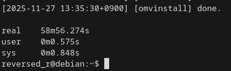

1つめの記事では50分かかったと言っておりましたが、こちらでも実に59分をかけてインストールが完了しました。

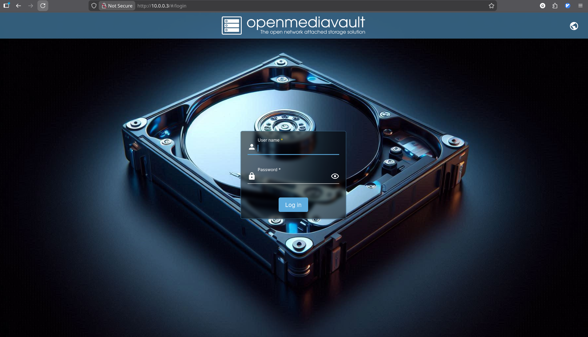
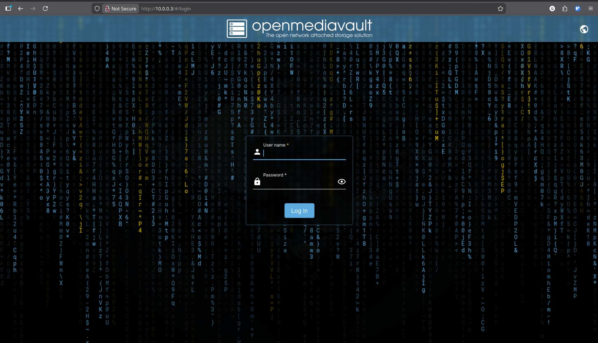

ついに、かっこいいOpenMediaVaultのWebUIにアクセスできました。やった〜〜〜〜!!!!

# あれ...

そういえば言ってなかったのですが、Debianを入れた直後に[WireGuard](https://www.wireguard.com/)をつなぎ([WORD](https://word-ac.net)にあるPCをwgサーバとして)、リモートで作業をしておりました。
上の画像群をよく見ると、家のLANで作用している当初は`192.168.11.0/24`ですが、OpenMediaVaultのWebUIにアクセスしたのは`10.0.0.0/24`からです。

なにはともあれOpenMediaVaultは無事にインストールされたので一度rebootしておきます。Debianを入れてからも2度くらいはrebootした気がするのできっと大丈夫でしょう。

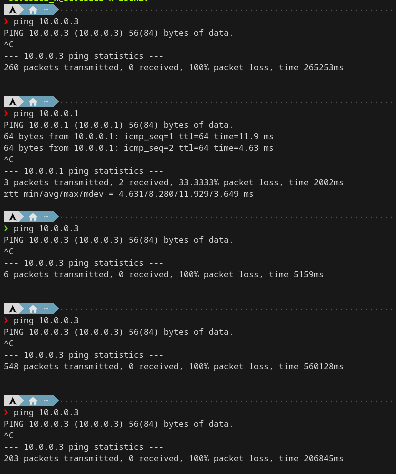

あれ...。

ping返ってこないんだけど。

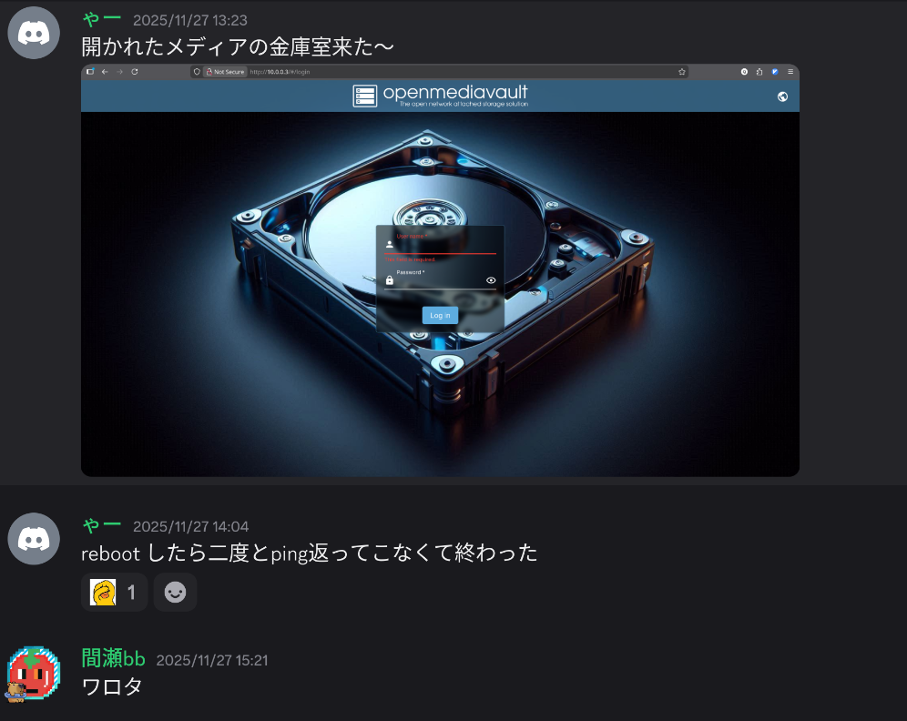

WireGuardのserviceをenableにし忘れたかと思ったりもしましたがそんなこともなく、家に帰って確認するとBuffalo自体は息をしているもののDebianがbootしていない様子...。

# 終わりに

こうして私のOpenMediaVaultは破壊され、閉ざされたメディアの金庫室になってしまいました。

そういうわけでこの記事は`前編`です。

もし進捗があれば`後編`が出ることでしょう。出なければそういうことです。

とりあえずディスクの中を見に行くためにSATA to USBケーブルをAmazonで購入しました。追加の出費です...。

みなさんはあまり渋そうなハードを買わないように(というか素の状態で使う以外が厳しい構成のハードを改造しないように)。

では、また。
